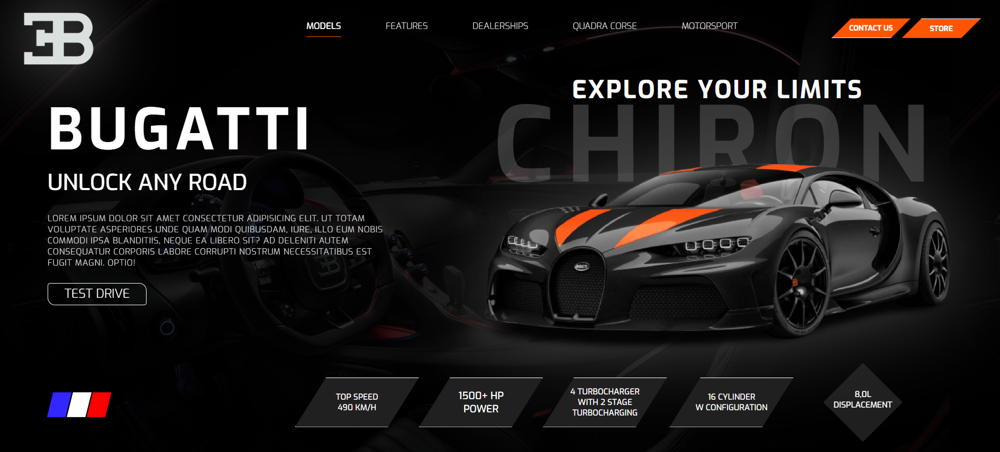

# BugattiLandingPage 🏎️

Este é um projeto de uma página de destino (landing page) da Bugatti, criada utilizando apenas HTML e CSS. O foco principal do projeto foi replicar o design visual de uma página estática da marca, sem funcionalidades dinâmicas ou design responsivo.

## 🛠️ Tecnologias Utilizadas

- **HTML5**: Estruturação da página.
- **CSS3**: Estilização fixa e layout estático.

## 💡 Funcionalidades

- Layout estático e estilização baseada no design clássico da Bugatti.
- Uso de cores e fontes que refletem a identidade visual da marca.
- Sem design responsivo (otimizado apenas para desktops).

## 📸 Prévia do Projeto



## 🚀 Como Executar o Projeto

1. Clone este repositório:
   ```bash
   git clone https://github.com/seu-usuario/BugattiLandingPage.git
   ```

2. Navegue até o diretório do projeto:
   ```bash
   cd BugattiLandingPage
   ```

3. Abra o arquivo `index.html` em qualquer navegador para visualizar a página.

## 📄 Licença

Este projeto é livre para uso pessoal ou educacional.

